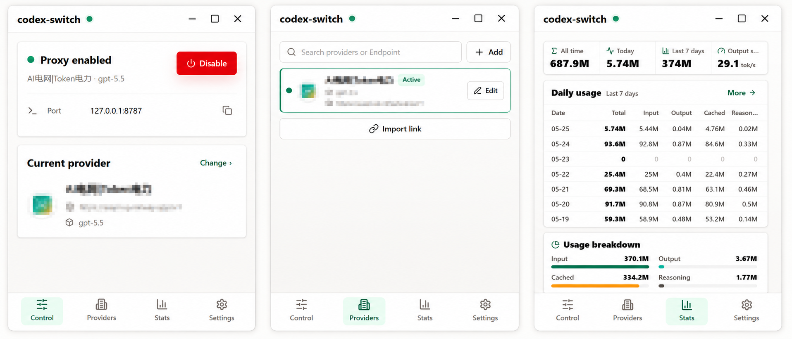

[中文](./README.md) | [English](./README.en.md)

# codex-switch

> Codex provider switching without giving up normal account-based login.

`codex-switch` is a local desktop provider switcher built specifically for Codex provider switching without giving up normal account-based login. It helps Codex stay signed in with a normal account while routing model traffic through a local proxy to switch OpenAI-compatible providers, then restores the original `~/.codex/config.toml` when proxying is disabled.

- Keep Codex signed in.
- Switch OpenAI-compatible providers through a local proxy.
- Restore the original Codex config when disabled.

That matters when you want to use third-party models, relay services, or custom endpoints without pushing Codex into a pure API-key-only workflow. The goal is to preserve the conditions needed for account-bound capabilities such as plugins and voice input while still adding provider switching.

## Preview

### App screenshot



### Enabled effect


## Why This Exists

Many provider switchers answer one question: which API should the next request use?

`codex-switch` answers a narrower Codex question: **how can Codex switch to a third-party provider while staying in the signed-in account workflow?**

If Codex is forced into a pure API-key path, account-bound capabilities such as plugins, voice input, and related signed-in features may break or weaken. Switching providers can also mean repeated manual edits to `~/.codex/config.toml`, which is tedious and easy to leave in a bad state.

`codex-switch` brings provider management, local proxying, model switching, config backup, and config restore into one desktop control surface for Codex.

## Core Capabilities

- Manage multiple OpenAI-compatible providers.
- Store provider name, endpoint, default model, homepage, notes, and API key.
- Store API keys in the system credential store instead of only in a plain config file.
- Switch the active provider and model with one click.
- Point Codex to a local `127.0.0.1` provider when proxying is enabled.
- Proxy `/v1/models`, `/v1/responses`, and `/v1/responses/compact`.
- Attach the selected provider's API key while stripping Codex's original `Authorization` / `Cookie` headers before forwarding upstream.
- Rewrite `responses/compact` requests to the selected provider model when needed.
- Remove `image_generation` tool calls for providers that do not support them.
- Restore the original Codex config when the proxy is disabled or the app exits.
- Keep the latest config backup for manual recovery.
- Detect Codex login mode from local auth state, including API key, ChatGPT login, mixed, and unknown.
- Import providers from `codexswitch://` and compatible `ccswitch://` links.
- Configure proxy port, Codex directory override, theme, and launch behavior.

## How It Differs From cc-switch

`cc-switch` is an all-in-one manager for multiple AI coding CLIs, including Claude Code, Codex, Gemini CLI, OpenCode, and OpenClaw. It also covers MCP, Skills, Prompts, usage, sessions, cloud sync, and other cross-tool workflows.

`codex-switch` is narrower and more specialized. It focuses on Codex alone and on one specific job: switching OpenAI-compatible providers without abandoning the Codex signed-in workflow.

| Dimension | codex-switch | cc-switch |
|---|---|---|
| Product position | Codex signed-in workflow + provider switching | All-in-one control surface for AI coding CLIs |
| Support scope | Codex only | Claude Code, Codex, Gemini CLI, OpenCode, OpenClaw, and more |
| Core problem | Switch providers without signing out of Codex | Manage provider configs, MCP, Skills, Prompts, usage, and more across tools |
| Key mechanism | Local proxy + reversible Codex config writes | Multi-tool config management plus proxy/failover and broader operations |
| Best fit | Codex users who want to preserve account-bound capabilities | Users managing several AI coding CLIs at once |

See more: [codex-switch vs cc-switch](./docs/codex-switch-vs-ccswitch.en.md).

## How It Works

1. The app inspects Codex `auth.json` and `config.toml` to understand the current login state.
2. When proxying is enabled, it starts a local service and rewrites Codex to use `codex-switch` as the active model provider.
3. The injected `model_providers.codex-switch` entry points to `http://127.0.0.1:{port}/v1` and sets `requires_openai_auth = true`.
4. Codex sends `/v1/models`, `/v1/responses`, and `/v1/responses/compact` requests to the local proxy.
5. The proxy forwards those requests to the selected upstream provider, attaches that provider's API key, and filters original Codex credentials before forwarding.
6. When proxying is disabled or the app exits, the previous `model_provider`, `model`, `openai_base_url`, and managed provider table are restored as far as possible.

See the full flow: [How it works](./docs/how-it-works.en.md).

## Good Fit For

- You are already signed into Codex and want to switch OpenAI-compatible providers.
- You do not want provider switching to cost you plugins, voice input, or similar account-bound capabilities.
- You frequently move between endpoints and default models.
- You want to stop editing `~/.codex/config.toml` by hand.
- You want proxy control, provider management, model fetching, and config recovery in one place.

## Not a Fit For

- You need one app to manage Claude Code, Gemini CLI, OpenCode, OpenClaw, and other tools. An all-in-one manager such as `cc-switch` is a better fit.
- You need cloud sync, full usage dashboards, or unified MCP / Skills / Prompts management across multiple tools.
- You require every account-bound Codex capability to work consistently across every Codex version and every provider. `codex-switch` is designed to preserve the signed-in workflow; it does not take over official Codex behavior.

## FAQ

### What is codex-switch?

`codex-switch` is a Codex-specific provider switcher. It uses a local proxy to forward Codex model requests to the selected OpenAI-compatible provider while keeping Codex in its normal signed-in workflow as far as possible.

### Does codex-switch take over Codex login?

No. It does not provide a new Codex login system and it does not ask you to sign out. It adds a local proxy between Codex and the upstream provider so provider switching can happen without intentionally abandoning account login.

### How do I switch Codex providers without signing out?

Enable the proxy in `codex-switch`. The app points Codex to a local `127.0.0.1` provider, then the local proxy forwards model requests to the selected third-party endpoint with that provider's API key.

### Will codex-switch overwrite my Codex config?

It writes a managed `model_provider`, `model`, and `model_providers.codex-switch` entry when enabled. Before writing, it keeps a backup; when disabled or exiting, it attempts to restore the original Codex configuration.

### Which providers are supported?

`codex-switch` targets OpenAI-compatible providers. A provider is a good candidate when it has an endpoint, an API key, a model name, and compatible `/v1/models` or `/v1/responses` behavior.

### Can codex-switch import ccswitch provider links?

Yes. It supports its own `codexswitch://` links and compatible `ccswitch://v1/import?resource=provider&app=codex...` provider import links.

More questions: [FAQ](./docs/faq.en.md).

## Quick Start

### Requirements

- Node.js
- pnpm
- Rust toolchain
- Tauri desktop build environment

### Install

```bash
pnpm install
```

### Development

```bash
pnpm dev
```

This starts both the frontend dev server and the Tauri desktop app.

### Common Commands

```bash
pnpm dev
pnpm build
pnpm typecheck
pnpm build:renderer
```

## Tech Stack

- Tauri 2
- React 18
- TypeScript
- Vite
- Rust

## Project Structure

```text
src/                React app entry and pages
src/pages/          Control, providers, import, and settings screens
src/components/     Shared layout and base UI components
src/features/       Feature modules for providers and settings
src/lib/            Frontend API bridge and helper utilities
src-tauri/src/app/  State, config writing, auth diagnostics, deep links, secrets, and app logic
src-tauri/src/proxy Local proxy implementation
```

## Recommended Reading

- [What is codex-switch?](./docs/what-is-codex-switch.en.md)
- [How it works](./docs/how-it-works.en.md)
- [codex-switch vs cc-switch](./docs/codex-switch-vs-ccswitch.en.md)
- [FAQ](./docs/faq.en.md)
- [Troubleshooting](./docs/troubleshooting.en.md)
- [llms.txt](./llms.txt)
- [llms-full.txt](./llms-full.txt)

## Reference & Thanks

This project is inspired by and developed with reference to:

- [farion1231/cc-switch](https://github.com/farion1231/cc-switch)
- [gaoguobin/codex-fast-proxy](https://github.com/gaoguobin/codex-fast-proxy)
