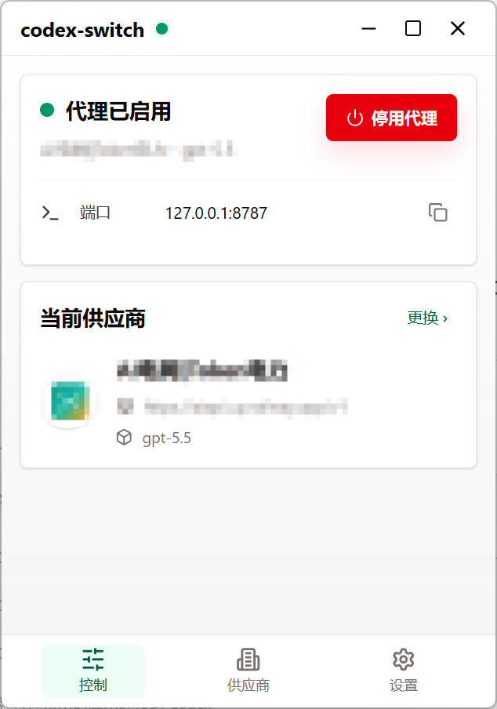
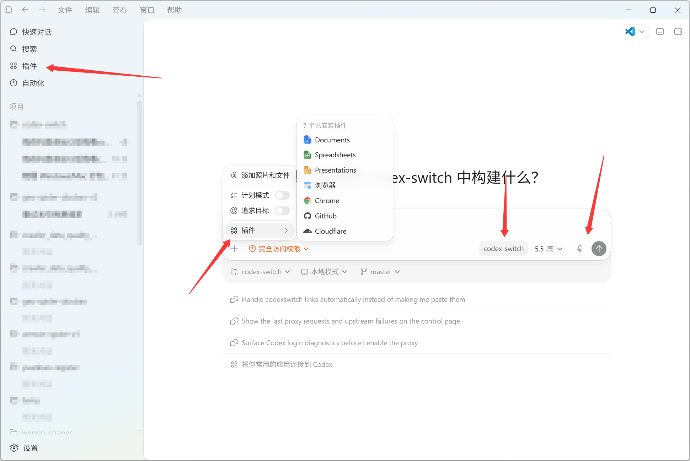

[中文](./README.md) | [English](./README.en.md)

# codex-switch

> 在保留 Codex 正常账号登录能力的前提下，为 Codex 提供供应商切换能力。

`codex-switch` 是一个基于 Tauri 构建的桌面应用。它要解决的核心问题，不是再做一个普通的 API Key 切换器，而是解决 `cc-switch` 在代理 Codex 时，难以继续使用正常账号登录相关能力的问题。

这类问题一旦出现，Codex 往往会退化成“只能走第三方 API Key”的模式，进而影响插件、语音输入等依赖正常账号登录状态的能力。`codex-switch` 的目标，就是让 Codex 在账号已登录的情况下，继续保留这类账号态能力，同时获得多供应商切换能力。


- 不替代 Codex 的账号登录
- 不要求退出当前账号
- 不把 Codex 降级成只能直连第三方 API 的工作流
- 在本地代理层完成供应商切换、模型转发和配置恢复

## 效果预览

### 软件截图



### 启用效果



## 要解决的问题

- `cc-switch` 在代理 Codex 的场景下，难以兼顾正常账号登录能力与第三方供应商切换
- 直接改写配置或走纯 API Key 模式，容易让插件、语音输入等账号态能力无法正常使用
- 多供应商切换往往需要反复手改 `~/.codex/config.toml`，成本高且容易改乱
- 缺少一个可逆的、桌面端的一站式控制入口，来处理代理启停、配置切换和恢复

## 项目目的

`codex-switch` 的目的很明确：

1. 让 Codex 保持正常账号登录状态。
2. 在登录账号的前提下，为 Codex 接入可切换的 OpenAI-compatible 供应商。
3. 尽量保留插件、语音输入等依赖账号态的能力。
4. 把供应商切换、模型切换、代理启停和配置恢复整合到一个本地桌面应用里。

## 核心能力

- 管理多个 OpenAI-compatible 供应商
- 保存供应商名称、Endpoint、默认模型、主页、备注与 API Key
- 一键切换当前生效的供应商和模型
- 启用本地代理，为 Codex 注入 `codex-switch` 供应商入口
- 在停用代理或退出应用时恢复原始 Codex 配置
- 保留最近一次配置备份，便于手动恢复
- 识别 Codex 当前登录状态，包括 API Key、ChatGPT 登录、混合态与未知态
- 支持 `codexswitch://` 与 `ccswitch://` 深链导入供应商配置
- 从兼容的 `/v1/models` 接口拉取模型列表
- 可为不兼容的供应商移除 `image_generation` 工具请求
- 支持代理端口、自定义 Codex 配置目录、主题和开机启动设置

## 与普通切换方案的区别

普通的 provider switcher 往往关注“把请求转发到哪个 API”，而 `codex-switch` 更关注“在 Codex 已登录账号的前提下，怎样完成供应商切换”。

它不是替代 Codex 登录体系，而是在 Codex 与第三方供应商之间增加一层本地代理，让 Codex 仍然按登录态工作，再由本地代理把模型请求转发到你选中的供应商。这也是它和单纯 API Key 切换方案最大的区别。

## 工作方式

1. 应用检测 Codex 的 `auth.json` 与 `config.toml`，判断当前登录状态。
2. 启用代理后，应用启动本地服务，并把 Codex 当前模型供应商改写为 `codex-switch`。
3. 这条本地供应商配置会指向 `127.0.0.1` 本地代理，并保留 Codex 所需的登录态工作方式。
4. Codex 发出的 `/v1/models`、`/v1/responses` 等请求会先进入本地代理。
5. 本地代理再根据当前选中的供应商，把请求转发到对应的上游 Endpoint，并自动附带该供应商的 API Key。
6. 停用代理或退出应用时，程序会尝试恢复原来的 Codex 配置，保证切换过程尽量可逆。

## 适用场景

- 你已经登录了 Codex 账号，但还想切换不同供应商
- 你不希望为了切换供应商而丢掉插件、语音输入等账号态能力
- 你同时使用多个模型服务，需要频繁切换 endpoint 和默认模型
- 你不想继续手动维护本地 Codex 配置文件
- 你希望代理启停、供应商管理和配置恢复都在一个入口完成

## 技术栈

- Tauri 2
- React 18
- TypeScript
- Vite
- Rust

## 快速开始

### 环境要求

- Node.js
- pnpm
- Rust toolchain
- Tauri 桌面开发环境

### 安装依赖

```bash
pnpm install
```

### 本地开发

```bash
pnpm dev
```

这个命令会同时启动前端开发服务和 Tauri 桌面应用。

### 常用命令

```bash
pnpm dev
pnpm build
pnpm typecheck
pnpm build:renderer
```

## 项目结构

```text
src/                React 应用入口与页面
src/pages/          控制页、供应商页、导入页、设置页
src/components/     通用布局与基础 UI 组件
src/features/       供应商与设置相关功能模块
src/lib/            前端 API 封装与工具函数
src-tauri/src/app/  状态存储、配置写入、登录态诊断、深链、密钥与业务逻辑
src-tauri/src/proxy 本地代理实现
```

## 参考与致谢

本项目在设计与实现过程中参考了以下项目：

- [farion1231/cc-switch](https://github.com/farion1231/cc-switch)
- [gaoguobin/codex-fast-proxy](https://github.com/gaoguobin/codex-fast-proxy)
