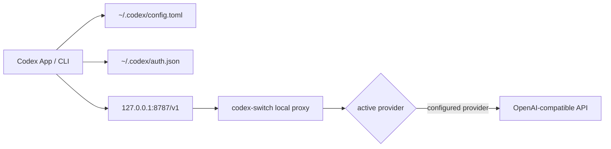

# codex-switch 技术设计

## 1. 技术栈

P0 使用 Tauri 2、Rust、React、TypeScript、Vite。

选择理由：

- Tauri 适合本地代理、配置文件写入、系统凭据和 URL scheme 注册。
- Rust 后端适合实现透明代理、原子文件写入和安全边界。
- React 前端用于管理多页状态、供应商表单和导入预览。

## 2. 总体架构



关键原则：

- Codex 登录态继续由 Codex 管理。
- `codex-switch` 只接管模型请求的 Base URL。
- 不提供内置官方默认路由，所有 upstream 都必须由用户显式配置。
- 转发到 upstream 前必须剥离 Codex 登录凭据，并注入 provider API Key。

## 3. 本地数据目录

```text
~/.codex-switch/
  state/
    state.json
  backups/
    config-YYYYMMDD-HHMMSS.toml
  logs/
    proxy.jsonl
```

P0 不引入数据库，使用 JSON 状态文件即可。后续如需 provider 历史和用量统计，再迁移到 SQLite。

## 4. 状态模型

### StoredState

```ts
interface StoredState {
  version: number;
  enabled: boolean;
  activeProviderId?: string | null;
  proxyPort: number;
  codexDirOverride?: string | null;
  launchAtLogin: boolean;
  themeMode: "light" | "dark";
  lastBackupPath?: string | null;
  lastWrittenModel?: string | null;
  restorePoint?: RestorePoint | null;
  providers: Provider[];
}
```

### Provider 归一化

状态加载时不注入任何内置 provider。若 `activeProviderId` 不存在或指向无效 provider，则归一化为 `null`。

### Provider

```ts
interface Provider {
  id: string;
  name: string;
  endpoint: string;
  apiKeyRef?: string | null;
  model: string;
  homepage?: string | null;
  notes?: string | null;
  icon?: string | null;
  disableImageGeneration: boolean;
  createdAt: number;
  updatedAt: number;
  keyStatus: "present" | "missing";
}
```

API Key 不保存到状态文件。优先使用系统凭据存储，状态文件只保存引用。

## 5. Codex 配置写入

默认写入策略固定为 `codex-switch` provider：

```toml
model_provider = "codex-switch"
model = "gpt-5-codex"

[model_providers.codex-switch]
name = "codex-switch"
base_url = "http://127.0.0.1:8787/v1"
wire_api = "responses"
requires_openai_auth = true
supports_websockets = false
```

实现要求：

- 使用 TOML parser 编辑配置。
- 写入前备份原配置。
- 使用临时文件加 rename 的原子写策略。
- 停用时恢复 `model_provider`、`model`、`openai_base_url`。
- 清理旧的 `[model_providers.codex-switch]` 残留。
- Codex 侧 provider id 始终固定为 `codex-switch`，真实上游只在本地代理内切换。
- 禁用 Responses WebSocket，避免代理环境下先重连再 fallback 到 HTTP。
- 不修改 `auth.json`。

## 6. Local Proxy

监听地址固定为 `127.0.0.1`。

允许路径：

- `POST /v1/responses`
- `POST /v1/responses/compact`
- `GET /v1/models`
- `GET /health`

其他路径返回 404。

### Provider 转发

当 active provider 存在且 API Key 可用：

- upstream 使用 provider endpoint。
- 删除入站 `Authorization`、`Cookie`、`Host`、hop-by-hop headers。
- 从系统凭据读取 provider API Key。
- 注入 `Authorization: Bearer <provider-api-key>`。
- 不记录请求体、提示词、工具参数或模型输出。

### 流式响应

对 `text/event-stream` 按 chunk flush，代理不解析、不缓存模型输出。

## 7. URL 导入

支持：

```text
codexswitch://v1/import?resource=provider&name=My%20Provider&endpoint=https%3A%2F%2Fapi.example.com%2Fv1&apiKey=sk-xxx&model=gpt-5-codex&enabled=true
```

兼容：

```text
ccswitch://v1/import?resource=provider&app=codex&name=My%20Provider&endpoint=...&apiKey=...
```

参数规则：

- `resource` 必须是 `provider`。
- `app` 如存在必须是 `codex`。
- `name` 必填。
- `endpoint` 必填，必须是 http(s) URL；逗号分隔时 P0 使用第一个。
- `apiKey` 可为空。
- `model` 缺省为 `gpt-5-codex`。
- `enabled=true` 只表示建议切换。

## 8. 安全边界

- 只监听 `127.0.0.1`。
- 不记录 API Key、Cookie、Authorization、请求体、提示词、工具参数和模型输出。
- upstream 永远不能收到 Codex/ChatGPT 登录凭据。
- 远程配置导入只允许 HTTPS，并必须用户确认。
- 停用和删除 provider 不修改 Codex 登录态。
